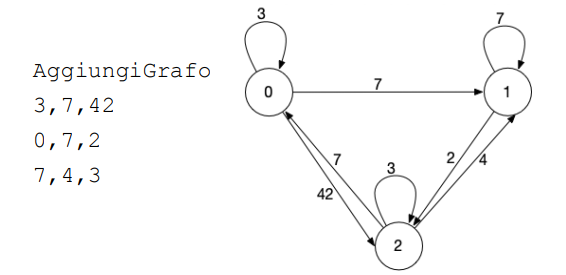

# Graph Ranker

Final project for the Algorithms and Principles of Informatics course, Computer Science Engineering branch at Politecnico di Milano, A.Y. 2020/21.

## Objectives

- Practical application of the techniques learned in the algorithms module and data structures of the course.
- Implementation of a solution to a problem by paying attention to concrete aspects of the code's efficiency - performance.

## Realization

- C language (C11, VLA allowed)
- No external library beyond the standard C library
- No multithreading
- Incoming data received via stdin, results to be provided via stdout

## Explanation

1. The goal of this project is to manage a ranking of weighted direct graphs.
2. The ranking keeps track of the k "best" graphs.
3. The program receives two parameters as input at the start: **d** (the number of nodes in the graphs) and **k** (the length of the ranking), separated by a space.
4. Then it receives a series of commands:

   - **AddGraph** (*AggiungiGrafo*) : Adds a graph to those considered to draw up the ranking. It's followed by the adjacency matrix of the graph itself, printed row by row, with the elements separated by commas. The nodes of the graph are to be considered logically labeled with an index integer between 0 and d-1; the node in position 0 is the one whose forward star is described by the first row of the matrix.

        

        *Example with d=3*
   - **TopK** : Consider each graph from the beginning of the program up to the TopK command
labeled with an integer index corresponding to the number of graphs read
before it (starting from 0); TopK prompts the program to print the integer indices of the k graphs having the smallest k values ​​of the following metric:

        - Sum of the shortest paths between node 0 and all the other nodes of the graph.
        - If there are more graphs with the same metric value, the precedence to the first arrivals.
        - The k integer indices are printed, on a single line, separated by a space, in any order.

## Example

```
# <-- Input                                     # --> Output and comments

3,2                                             # Set graph dimension to 3 and show best 2
AggiungiGrafo                                   # Add a 3x3 graph
0,4,3
0,2,0
2,0,0
AggiungiGrafo                                   # Add another 3x3 graph
0,0,2
7,0,4
0,1,0
AggiungiGrafo                                   # Add yet another 3x3 graph
3,1,8
0,0,5
0,9,0                                           # Expected result
TopK                                            1,0 # or 0,1
```

## Decisions

Due to the nature of the project, being both space and time efficient, I made the following decisions:

- Store only the best graph weights and indexes instead of the whole matrix, as heavier graphs will never be in the top k list except the first few.

- Sort the best graphs using the merge sort algorithm, as it is the most efficient in this scenario.

- Track the worst "best" graph in position k-n to speed up comparison and substitution, especially in cases where graphs given in input are progressively "better" than the previous ones, thus reducing time taken.

- Read input through `getchar_unlocked()`, which is faster in comparison to other input reading options.
